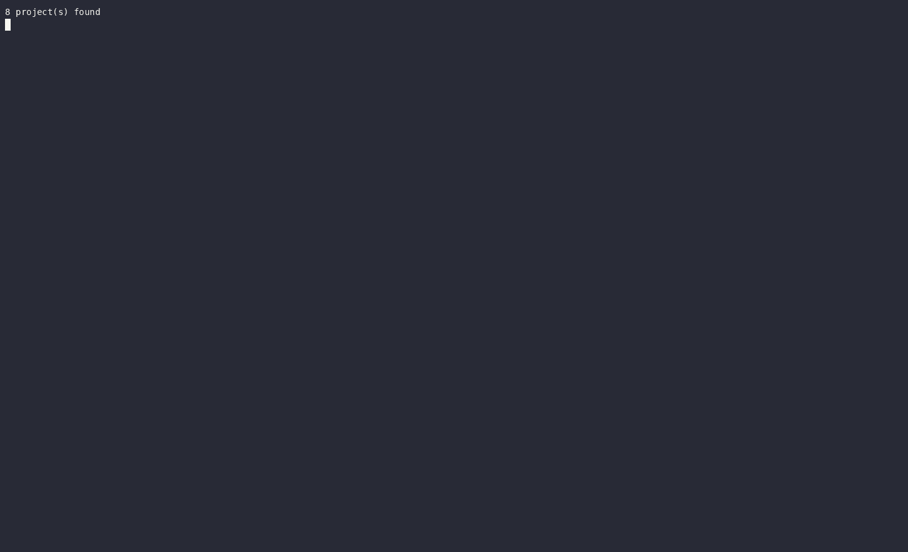

# Stencicrity

Several KiCad boards on one solder-paste stencil, cut apart and pinned on a jig.

      

## Introduction

Stencicrity merges the solder-paste gerbers of several KiCad projects into one
stencil order. Each of our boards would use a few square centimetres of a
380 x 280 mm sheet, so every board side is placed on one sheet of a standard
size, all paste openings are copied over, the border of every board is marked
with dotted lines so the sheet can be cut apart, and alignment slots are cut on
a fixed raster so every cut-out piece fits the same pin jig. The result is a
single `F_Paste` gerber, packed in a zip with a copper reference layer, that a
stencil house cuts like any other.

One thing the tool cannot decide on its own: copper pads that have no paste
opening in the source (test points, jumper pads, connectors soldered by hand).
Those are collected and shown in a terminal UI where you decide, pad by pad,
whether they get an opening. The decisions live in `.stencicrity`, a plain
text file next to the gerbers, so a second run over the same boards needs no
interaction.

## Demo

## Features

TODO: The features here should instead be user-level, high level overview of the features, like:
Join a bunch of setencils into one
Fine-tune which pads will be open or not
Add paste application jig alignment datum
Auto-arrange in different sheet sizes
etc
As simple to read as possible, to give the user a reason to try this software out. 

- Sheet sizes from 270 x 270 to 700 x 600 mm, landscape or portrait, with a
  fit check for every size in both orientations.
- MaxRects placement: three heuristics are tried, the one that places the most
  cells in the smallest block wins, and the block is centred on the sheet.
- Dotted borders along every cell edge; where two cells touch, the cut runs
  between their two lines.
- The `slots` datum: obround slots on the 20 mm raster of a modular pin jig
  along the bottom and left edge of every cell, and an X marking the datum
  corner. The legacy `holes` datum cuts four corner dowel holes instead.
- Pad decisions with defaults: pads without paste start `undefined`, `NT` and
  `TP` references start `ignore`, and a pad that already has paste can be
  closed.
- Everything a run needs in `./.stencicrity`, a plain text file written on
  every run and meant to be edited by hand.
- A TUI with four pages (Pads, Sides, Stencil, Layout), vim-style search, an
  all-pads view and a split view that draws the sheet in the terminal.
- A PNG preview of the whole sheet with millimetre rulers, a label in every
  cell and a legend.
- Output: RS-274X gerbers in the format KiCad writes, the zip to upload and a
  report with every slot, hole and pin coordinate.
- One statically linked binary. A batch run over the eight example boards
  takes about half a second and a re-pack a sixth of a millisecond, which is
  why the TUI re-packs on every change ([docs/benchmarks.md](docs/benchmarks.md)).

## Getting started

Install the release package for your distribution. On Arch (x86_64):

    curl -fsSL -o /tmp/stencicrity.pkg.tar.zst "$(curl -fsSL https://api.github.com/repos/Alacrity-Education/Stencicrity/releases/latest | grep -o 'https://[^"]*\.pkg\.tar\.zst' | head -1)" && sudo pacman -U /tmp/stencicrity.pkg.tar.zst

On Debian 13 and Ubuntu 24.04 or newer (amd64):

    curl -fsSL -o /tmp/stencicrity.deb "$(curl -fsSL https://api.github.com/repos/Alacrity-Education/Stencicrity/releases/latest | grep -o 'https://[^"]*_amd64\.deb' | head -1)" && sudo apt install /tmp/stencicrity.deb

At run time the binary needs nothing but the C runtime (`gcc-libs`
and `glibc` on Arch, `libc6` and `libgcc-s1` on Debian), which the package
pulls in; `xdg-utils` is optional and opens the preview PNG in the desktop
image viewer.

Or build from source, with cargo and rustc 1.85 or newer:

    cargo build --release       # target/release/stencicrity
    cargo install --path .      # or a stencicrity on the PATH

First run:

1. Put the KiCad gerber zips of all the projects in one folder and `cd` into
   it.
2. Run `stencicrity`.
3. A preview PNG opens in the image viewer and the TUI starts in the terminal.
4. Fine-tune the openings: `space` cycles the state of the pad under the
   cursor, `n` jumps to the next undefined one, `p` re-renders the preview.
5. Press `w`.
6. `stencil-out/stencil.zip` is the final order.

## How it works

The picture is `stencil-preview.png` from a
`stencicrity` run over the eight example
boards this tool was developed with, at the default 20 px/mm.
The preview is drawn on a dark background
with millimetre rulers along the left and bottom edges, a faint dashed guide
under every dotted line, a label in every cell and a legend underneath.

TODO: Give an overview of the workflow in stencicrity. Cycle trough unsure pads and decie, select the sheet size, tune parameters (explain what the parameter groups do), explain how search and * work.

## Pad Handling

Paste openings from the source gerbers are copied to the stencil as they are:
same aperture, same shape, same position. What needs a decision are the copper
pads the paste layer does not cover. A pad is pasted when an
opening contains its centroid or the openings cover at least 10 % of its area.
The rest are *candidates*, each in one of three states:

| state | meaning |
| --- | --- |
| `undefined` | not decided yet; no opening is cut |
| `open` | an opening is cut with the copper pad's own aperture |
| `ignore` | deliberately left closed |

TODO: Reword this paragraph simpler: Some pads are auto-detected: TP, NT(net-tie)
Candidates start `undefined`, except those whose reference is one of the
`[rules] ignore_prefixes` followed by a digit (`TP3`, `NT12`; not `TPS1`). The
default list is `NT TP`, so net ties and test points start as `ignore` and do
not have to be waved through one by one.

## TUI Controls

TODO: Some of these need to go in how to use section. This section will remain only as a reference with the controls. 

Four pages, switched with `1`-`4`, `Tab` and `Shift-Tab`:
 1. TODO 
 2.TODO
 3.TODO
 4.TODO

TODO Inline table to above list. Outline search features in 1. (Search using `/` - vim style)
| page | what happens there |
| --- | --- |
| Pads | the candidates of the enabled sides: state, reference and pin, project, side, aperture function, shape, position; `*` adds the pasted pads (dimmed, marked with a `·`) so they can be closed |
| Sides | switch board sides on and off; each row shows size, paste count, pads to decide and how many are still undefined |
| Stencil | pick the sheet size; every row shows whether the block fits in landscape and in portrait |
| Layout | spacing, the datum (`slots`/`holes`/`none`), hole diameter and inset, the six slot numbers (width, length, offset, pitch, web, pin diameter), the orientation marker and its size, dot diameter and pitch, dotted line gap, dot clearance, hole grid, outer border, sort order; the rows of the datum that is not selected are dimmed but stay editable |

| key | action |
| --- | --- |
| `↑`/`↓`, `j`/`k`, `PgUp`/`PgDn`, `Home`/`End` | move |
| `g` / `G` | first / last row, on every page |
| `space` | Pads: cycle undefined → open → ignore → open ...; Sides: toggle; Stencil: pick; Layout: flip a switch, cycle the datum (slots → holes → none) or the sort order |
| `o` / `i` | Pads: set open / ignore (`o` on the Stencil page toggles the orientation) |
| `a` | Pads: apply the current pad's state to every pad of the same component |
| `n` / `N` | Pads: next / previous undefined pad |
| `*` | Pads: show all pads, including the ones with paste |
| `A` / `N` | Sides: all on / all off |
| `+` / `-` (also `→` / `←`) | Layout: step a number by 0.5 mm (0.1 mm for the dot clearance, 1 mm for the hole grid, 5 mm for the slot pitch), or cycle the datum |
| `e` | Layout: type a value (typing replaces, Backspace edits, Enter accepts, Esc cancels); on the datum row it cycles |
| `Enter` | Sides: toggle the side; Stencil: pick the size; Layout: edit the value like `e`; Pads: nothing |
| `p` | render the preview PNG and open it in the image viewer |
| `v` | split view: the sheet around the selected pad, drawn in the terminal |
| `w` | generate, on every page; when the layout does not fit it asks once more ("press w again") and any other key cancels that |
| `Esc` | cancel an inline edit, else cancel a pending `w`, else clear an active filter, and nothing at all otherwise; Esc never quits |
| `q` (or `Ctrl-C`) | quit without generating; the configuration is saved |

**Search.** `/` starts a search on the Pads and Sides pages, vim style: the
query is typed into the footer and the list filters while you type. A row is
kept when any word of the query is a substring of any of its fields
(reference, pin, project, side, function, shape, state, position; pasted pads
also answer to `paste`, and to `closed` once their opening was removed). Rows
are ranked by how many words they match, rows that match every word are bold,
and the sub-header says how many rows are shown and how many are full matches.
Enter leaves the search but keeps the filter: the list stays filtered and every
key above works on the rows that are left (toggling a side or `*` re-applies
the filter). Esc leaves the search and clears the filter, and clears a kept
filter later on, the way vim's `:noh` drops a highlight; either way the cursor
stays on its row. `/` always starts a new, empty search, and every page keeps
its own filter.

**Split view.** `v` divides the terminal with a `│`: the pages keep the left
half and the right half draws the sheet around the pad the Pads page cursor is
on, whatever page is in front. It is the same picture as the PNG, in half
blocks (two sub-pixels per character cell, so one millimetre is the same
number of pixels across and down) and in the same colours, with cyan for the
pad under the cursor. A caption names the pad, its project and side, the
window size in millimetres and the millimetres per column; a one line legend
appears under the picture when the right half is at least 5 rows tall. The
zoom follows the selected pad: its larger dimension spans a quarter of the
panel, never fewer than 3 columns and never more than the whole width, and the
window is centred on it. Moving the cursor or changing a pad, a side or a
layout number redraws it. The split wants a 150 column terminal (90 for the
app, one for the line, the rest for the picture); below that the right half
only says `Terminal preview requires a larger terminal, please resize.` `v`
again turns it off.

## Output files
Everything goes to `--out` (default `./stencil-out`), prefixed with `--name`
(default `stencil`):

| file | content |
| --- | --- |
| `stencil-F_Paste.gbr` | the stencil: paste openings, opened pads, border dots and the datum (alignment slots or dowel holes, plus the orientation X of every cell) |
| `stencil-F_Cu.gbr` | the copper of every board, for checking the alignment (`--no-copper` leaves it out) |
| `stencil-Edge_Cuts.gbr` | the sheet rectangle as a 0.1 mm outline, only with `--outline` |
| `stencil.zip` | the gerbers above; this is what we upload |
| `stencil-preview.png` | the preview |
| `stencil-report.txt` | sheet and block size, the winning heuristic, a `Datum:` block naming the mode and its numbers (for `slots`: the raster, the walls, the slot count per edge) and, under `slots`, a `Marker:` block with the raster point the X sits on and how far its cut reaches (`off` when it is switched off, a WARNING when it would cross the cell edge or reach a slot), then a `Grid:` block saying whether every jig pin is on the raster (`slot_pitch` for the slots, `hole_grid` for the holes) and what it cost in cell area, then every cell with its board rectangle, its datum corner, the centre of its orientation X, all its slot or dowel hole coordinates and its jig pin centres (on the sheet and relative to the board corner) plus the direction to push it, pad counts, the dot count with how many dots were dropped for coming closer than `dot_clearance` to a slot, hole or marker, file list |

The gerbers are RS-274X with X2 attributes in the format KiCad writes
(`FSLAX46Y46`, `MOMM`), headed by
`%TF.GenerationSoftware,Alacrity-Education,stencicrity,<version>*%`. The
colours of the preview, and of the split view in the TUI:

TODO: Move the color legend to pad handling
| colour | meaning |
| --- | --- |
| red | everything that becomes an opening: paste, opened pads, dots, alignment slots, dowel holes, the orientation X (drawn in the `dot_dia` stroke width it is cut with) |
| blue dashed outline | a jig pin where it comes up through the foil (through a slot, or through a dowel hole) |
| orange bracket | the datum corner of a cell, with a small green arrow pointing at it: the direction the piece is pushed (slots datum); the red X sits just inside the bracket |
| yellow | undefined candidates (no opening); a component with undefined pads gets a labelled yellow box |
| blue | ignored candidates and closed paste openings |
| grey | copper, and pads that already have paste |
| light grey | board outlines and the sheet boundary |
| cyan | the pad under the cursor when the preview is rendered from the TUI |

- Linux only. The configuration file is written through a temporary file with
  Unix permissions and the process umask is read from `/proc/self/status`, so
  the crate does not build for Windows as it stands.

## Documentation

[`docs/README.md`](docs/README.md) indexes the rest:

- The design study, [`docs/kinematic-alignment.md`](docs/kinematic-alignment.md):
  locating cut stencil pieces on a pin jig; the `slots` datum comes from it.
- The benchmarks, [`docs/benchmarks.md`](docs/benchmarks.md): stage timings and
  peak memory, with the comparison against the retired Python implementation.
- The developer docs: architecture, data model, gerber reader and writer,
  packer, configuration file, TUI, preview renderer, and how to develop,
  package and release ([`docs/development.md`](docs/development.md)).

This project is built **entirely** with AI agents. It serves to automate a time-consuming process that we would have to do manually. Being a low-risk project (we can always do what this does within KiCad), we have taken the liberty to benchmark LLM's capabilities to write helper tools with a given specification and very minimal technical guidance.
Rust was chosen as a language whose compiler helps verify what the LLM does without many repetitive write-test-debug cycles.  

## Contributing

Issues and pull requests go to
[GitHub](https://github.com/Alacrity-Education/Stencicrity).

Releases are tagged `vX.Y.Z` on a commit whose `Cargo.toml` carries that version, and the release workflow
builds the Arch and Debian packages and attaches them to the release.

## License

TODO: Licese should be a relative link, not a code block
AGPL-3.0. See `LICENSE`.
