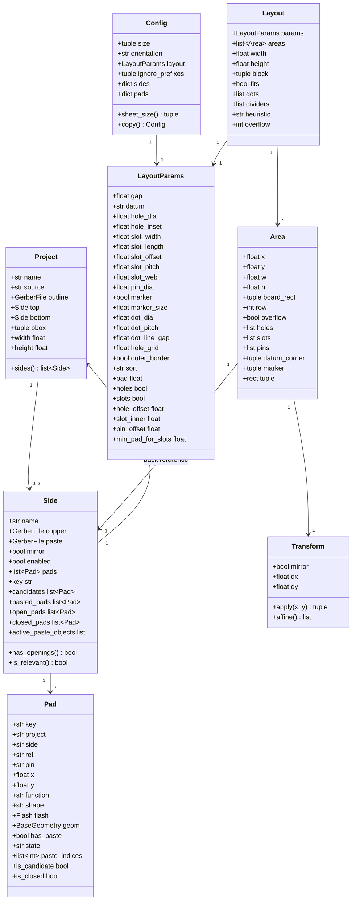

# Data model

Everything the program passes around lives in `pcbstencil/model.py`: nine
dataclasses, a handful of constants and three helper functions. The module
imports only shapely and `pcbstencil.gerber`, so it is the bottom of the
dependency graph and safe to import from anywhere.

## Coordinate systems

Three of them, in this order:

| Name | Origin | Unit | Used by |
| --- | --- | --- | --- |
| Board coordinates | whatever the KiCad export used (often negative Y) | mm | `GerberFile.objects`, `Pad.x/y`, `Pad.geom`, `Project.bbox` |
| Sheet coordinates | bottom left corner of the stencil, X right, Y up | mm | `Area`, `Layout`, the divider lines, the dots, the datum (slots, holes, pins), the written gerbers, the report |
| Image pixels | top left corner of the PNG, X right, Y **down** | px | `render.py` only |

Board to sheet is one `Transform` per placed side. Sheet to pixels is
`render._Frame.to_px()`, which is where the Y axis flips:

```
to_px(x, y) = (frame.left + x * ppmm,  frame.origin_y - y * ppmm)
```

Nothing else flips anything. The top and bottom layers of one project share the
same board coordinates; a bottom side is mirrored on the *sheet*, not in the
board coordinates, so the stencil piece matches the board once the board is
turned over.

## Constants

| Name | Value | Meaning |
| --- | --- | --- |
| `SIDE_TOP`, `SIDE_BOTTOM` | `"top"`, `"bottom"` | `Side.name` and the second field of a side key. |
| `STATE_UNDEFINED`, `STATE_OPEN`, `STATE_IGNORE` | `"undefined"`, `"open"`, `"ignore"` | The three pad states. |
| `STATES` | the three above, in that order | Accepted values in the `[pads]` section; `pads.state_counts()` returns one counter per entry. |
| `STENCIL_SIZES` | `(270,270) (380,280) (420,320) (450,350) (460,460) (520,420) (600,600) (700,600)` | The orderable sheet sizes in mm, long side first, smallest first. The Stencil page of the TUI and the `--size` choices come straight from this tuple. |
| `DEFAULT_STENCIL_SIZE` | `(380, 280)` | A literal, *not* `STENCIL_SIZES[0]` - the list starts at 270x270 but the default is still 380x280. |
| `ORIENTATION_LANDSCAPE`, `ORIENTATION_PORTRAIT`, `ORIENTATIONS` | `"landscape"`, `"portrait"` | Landscape puts the long side horizontal. For the square 270x270 both give the same sheet. |
| `SORT_HEIGHT`, `SORT_NAME`, `SORT_ORDERS` | `"height"`, `"name"` | Cell order handed to the packer. |
| `DEFAULT_IGNORE_PREFIXES` | `("NT", "TP")` | Reference prefixes whose pads without paste start as `ignore`. |

Helpers: `size_label((380, 280))` gives `"380x280"`; `parse_size("280x380")`
accepts `x` or `×` in either case and always returns the long side first, so it
gives `(380, 280)` and raises `ValueError` for anything that is not two
numbers; `side_key("RBARF", "top")` gives `"RBARF/top"`.

## The classes



### `Transform`

The board-to-sheet mapping of one placed side, built by `layout.pack()` and
used by the writer (`GerberWriter.add_object`) and the renderer.

| Field | Meaning |
| --- | --- |
| `mirror` | Mirror about the Y axis: `x -> -x`. Set for bottom sides unless `--no-mirror-bottom`. |
| `dx`, `dy` | Translation applied *after* the mirror. |

`apply(x, y)` returns `((-x if mirror else x) + dx, y + dy)`. `affine()` returns
`[a, b, d, e, xoff, yoff]` for `shapely.affinity.affine_transform`, i.e.
`[-1 or 1, 0, 0, 1, dx, dy]`. There is no rotation and no scaling anywhere in
the program, so those are the only two forms a transform can take. A mirrored
board occupies `[-maxx, -minx]` in x, which is why `pack()` computes
`dx = bx - (-maxx if mirror else minx)`. Mirroring also reverses the direction
of travel of an arc, which the writer compensates for.

### `Pad`

One pad flash on a copper layer. Created by `pads.detect_pads()`, never by hand.

| Field | Meaning |
| --- | --- |
| `key` | `"<project>/<side>/<REF>.<pin>@<x>,<y>"` with the board coordinates at three decimals, e.g. `RBARF/bottom/TP1.1@148.082,-99.568`. This is the identifier in the `[pads]` section, so it is stable as long as the footprint does not move in KiCad. |
| `project`, `side` | The names, not the objects (a pad has to be comparable without following references). |
| `ref`, `pin` | From the `%TO.P` object attribute; `?` and a running index when the flash has none. |
| `x`, `y` | The flash position in board coordinates, unmirrored. |
| `function` | First token of the aperture's `AperFunction`, e.g. `SMDPad`; may be empty. |
| `shape` | `Aperture.describe()`, e.g. `C ⌀1.00` or `R 0.70x0.70`. Display and configuration comments only. |
| `flash` | The `Flash` object itself. `_write_paste()` re-emits exactly this object for a pad the user opened, so an opened pad gets the copper aperture unchanged. |
| `geom` | The copper shape in board coordinates. Used for the paste overlap test, for `--open-shrink` and for the preview. |
| `has_paste` | True when the paste layer already opens this pad. Decided once at detection and never changed afterwards. |
| `state` | See below. |
| `paste_indices` | Indices into `side.paste_objects` of the openings that sit on this pad. Empty for a candidate. |

Which states are valid depends on `has_paste`:

| | `undefined` | `open` | `ignore` |
| --- | --- | --- | --- |
| Candidate (`has_paste == False`) | yes, the default | yes: an opening is cut from `flash` | yes: nothing is cut |
| Pasted pad (`has_paste == True`) | **never** | yes, the default: its openings stay | yes: its openings are dropped (the pad is *closed*) |

`is_candidate` is `not has_paste`; `is_closed` is `has_paste and state ==
"ignore"`. Both `config.apply_config()` and `tui.allowed_state()` enforce the
table above, so an `undefined` on a pasted pad is silently corrected to `open`.
`label` is `"REF.pin"` and `side_key` is `"project/side"`.

### `Side`

One side of one project, and one stencil cell when it is enabled.

| Field | Meaning |
| --- | --- |
| `project` | Back reference to the owning `Project`. |
| `name` | `"top"` or `"bottom"`. |
| `copper`, `paste` | The parsed `GerberFile`s, either of which may be `None`. |
| `mirror` | Placed mirrored on the sheet. Set by `project._build_project()` for bottom sides when `mirror_bottom` is on. |
| `enabled` | The user switch, from `[sides]` or the Sides page. |
| `pads` | Every pad flash found on the copper layer, pasted ones included, sorted by reference and pin. |

The derived collections are all recomputed on every access - they are cheap
list comprehensions over `pads`, not cached state:

| Property | Contents |
| --- | --- |
| `paste_objects` / `copper_objects` | The graphic objects of the two layers, or `[]` when the layer is missing. |
| `candidates` | Pads without paste. The default list on the Pads page. |
| `pasted_pads` | Pads with paste. Shown only in the all-pads view. |
| `open_pads` | Candidates the user set to `open`. These get an opening cut from the copper flash. |
| `closed_pads` | Pads with paste the user set to `ignore`. |
| `closed_paste_indices()` | The union of `paste_indices` over `closed_pads`. |
| `active_paste_objects` | `paste_objects` minus the entries in `closed_paste_indices()`. This is what the writer emits and the preview paints red. |
| `closed_paste_objects` | The complement; the preview paints these blue so the change stays visible. |

Two predicates decide the side's fate:

* `is_relevant()` - `paste_objects` or `candidates` is non-empty. A side has to
  be relevant to appear in the side table, in the TUI, in `[sides]` and in the
  first packing.
* `has_openings()` - `active_paste_objects` or `open_pads` is non-empty. A side
  has to have openings to survive into the *final* packing; one that does not
  is dropped with a message. Note the asymmetry: a side with paste openings the
  user then closed is relevant but has no openings.

### `Project`

| Field | Meaning |
| --- | --- |
| `name` | First field of `%TF.ProjectId` from any parsed layer; otherwise the zip or directory basename with a `GERBER-` / `gerber-` / `gerbers-` prefix stripped. Duplicates get `" (2)"`, `" (3)"` appended. |
| `source` | The zip path or directory it came from. |
| `outline` | The parsed `Profile` / `Edge_Cuts` layer, or `None`. |
| `top`, `bottom` | The two `Side`s; either may be `None` when neither copper nor paste exists for it. |
| `bbox` | `(minx, miny, maxx, maxy)` in board coordinates. |

`bbox` is the outline layer's bounds when there is an outline with drawable
objects; otherwise the union of the bounds of the copper and paste layers. It
is the *only* thing the packer knows about a board: `width` and `height` are
derived from it and a cell is `bbox + gap`. A project with no drawable object
on any layer is skipped at discovery.

### `LayoutParams`

The `[layout]` section and the Layout page of the TUI, one dataclass.

| Field | Unit | Default | Meaning |
| --- | --- | --- | --- |
| `gap` | mm | 30.0 | Spacing between two neighbouring boards. Half of it is the padding around each board. |
| `datum` | - | `"slots"` | Which alignment features every cell gets: `DATUM_SLOTS`, `DATUM_HOLES` or `DATUM_NONE` (`"slots"` / `"holes"` / `"none"`, the tuple `DATUM_MODES`). |
| `hole_dia` | mm | 5.0 | Dowel pin hole diameter (`holes` datum). |
| `hole_inset` | mm | 2.0 | Cell edge to the *edge* of the hole. May be negative, which moves the hole out onto the edge. |
| `slot_width` | mm | 4.5 | Slot size *across* the cell edge (`slots` datum). |
| `slot_length` | mm | 8.0 | Slot size *along* the cell edge. |
| `slot_offset` | mm | 0.5 | Cell edge to the slot's outer wall. The slot may clip the cell's *own* dotted line (which runs `dot_line_gap/2` inside the edge) but never reaches the neighbouring cell; may be 0 but never negative. |
| `slot_pitch` | mm | 20.0 | Raster of the modular jig: slot centres along the bottom and left edges and the pin centres across them lie on it, and cells grow to whole multiples of it. Must be positive. |
| `slot_web` | mm | 3.0 | Least foil between a slot's inner wall and the board. A cell grows until it fits. |
| `pin_dia` | mm | 3.0 | Jig pin diameter for the `slots` datum; the `holes` datum uses `hole_dia` pins. |
| `marker` | - | True | `slots` datum: cut an X into the foil at the raster point `pin_offset` inside the datum corner, so the orientation of a cut-out piece can be read at a glance. |
| `marker_size` | mm | 4.0 | Length of each of the X's two strokes; they are cut `dot_dia` wide. Must be positive. |
| `dot_dia` | mm | 0.5 | Divider dot diameter. Also the minimum distance used to deduplicate dots. |
| `dot_pitch` | mm | 3.0 | Centre-to-centre spacing of the divider dots. |
| `dot_line_gap` | mm | 2.5 | How far *inside* its edge a cell's dotted line runs: half of this. Two touching cells therefore show two lines this far apart and the cut goes between them; 0 puts every line on the edge itself, so touching cells share one. |
| `hole_grid` | mm | 8.0 | `holes` datum only: the common grid every dowel hole (and so every jig pin) must land on, measured from the sheet origin. 0 switches it off. The `slots` datum has its own raster, `slot_pitch`. |
| `outer_border` | - | False | Also dot the cell edges that lie on the outer boundary of the block. |
| `sort` | - | `"height"` | `height` (tallest board first) or `name`. |

The derived values, all used in `layout.py`:

* `pad` = `gap / 2` - the padding between a board and its cell edge. The cell
  grows for the slot raster and for the hole grid, so `pad` becomes the
  *minimum* padding and the report prints `padding ≥ 15.0 mm`.
* `holes` - **a read-only property**, `datum == "holes"`. It used to be a
  writable boolean field; everything that set `holes=True/False` now sets
  `datum` instead (`config.py` still reads a legacy `holes = on | off` line and
  maps it, see [pads-and-config.md](pads-and-config.md)).
* `slots` - the same for `datum == "slots"`.
* `hole_offset` = `hole_inset + hole_dia / 2` - cell edge to the hole *centre*
  (`holes` datum). With the defaults that is 4.5 mm.
* `slot_inner` = `slot_offset + slot_width` - cell edge to the slot's inner
  wall, the wall the pin touches. 5.0 mm by default.
* `pin_offset` - cell edge to the pin centre of whichever datum is active:
  `slot_inner - pin_dia / 2` (3.5 mm) for slots, `hole_offset` (4.5 mm) for
  holes. This is the number the raster arithmetic snaps: a cell corner sits at
  `k * pitch - pin_offset`.
* `min_pad_for_slots` = `slot_inner + slot_web` - the smallest cell padding
  that hosts a slot plus its web to the board. 8.0 mm by default, so the
  default 15 mm padding is comfortable and the rounding to whole `slot_pitch`
  steps is what actually sizes the cell.

### `Config`

The whole `.stencicrity` file.

| Field | Meaning |
| --- | --- |
| `size` | `(long, short)` in mm, always long side first, and always one of `STENCIL_SIZES` (a file value that is not gets a warning and is dropped). Default `(380, 280)`. |
| `orientation` | `"landscape"` or `"portrait"`. |
| `layout` | A `LayoutParams`. |
| `ignore_prefixes` | The `[rules] ignore_prefixes` tuple, upper case, no duplicates. |
| `sides` | `{"<project>/<side>": bool}`. |
| `pads` | `{"<pad key>": state}`. |

`size` stores the sheet, `orientation` decides how it is laid out:
`sheet_size()` returns `(long, short)` for landscape and `(short, long)` for
portrait, as floats - that is the `(width, height)` every sheet coordinate is
measured against. `size_label` is `"380x280"`. `copy()` is a deep-enough copy
(a `dataclasses.replace` of the layout, new dicts, a new tuple) used by the TUI
to probe a size or orientation without disturbing the live configuration.

The two dictionaries are the file's memory. They may hold keys that do not
exist in the current gerbers; see
[pads-and-config.md](pads-and-config.md) for how those are kept.

### `Area`

The placement of one side, produced by `layout.pack()`.

| Field | Meaning |
| --- | --- |
| `side` | The `Side` placed here. |
| `x`, `y` | Bottom left corner of the *cell* in sheet coordinates. |
| `w`, `h` | Cell size: board plus gap, grown for the datum (the slot padding, or the hole grid). |
| `board_rect` | `(minx, miny, maxx, maxy)` where the board bounding box lands on the sheet. The board is centred in the cell. |
| `transform` | Board to sheet for this side's objects. |
| `row` | The index in the packing order. Informational only - there are no rows, the cells are packed with MaxRects. |
| `overflow` | The cell did not fit and was parked to the right of the sheet. |
| `holes` | The dowel hole centres of this cell in sheet coordinates (`holes` datum). Empty under any other datum *or* when a neighbouring cell already carries the same hole. |
| `slots` | The obround slots of this cell as `(cx, cy, w, h)` in sheet coordinates, `w` along x and `h` along y (`slots` datum; empty otherwise). One per `slot_pitch` raster position that fits: first the bottom edge left to right (`length x width`), then the left edge bottom to top (`width x length`). An edge of `n` pitches carries `n - 1` of them, and a cell always has at least 2 + 1. |
| `pins` | The jig pin centres in sheet coordinates, for *either* datum: one per slot, tangent to its inner wall, for `slots`; identical to `holes` for `holes`; empty for `none`. Every one of them lies on the datum's raster (`slot_pitch` or `hole_grid`). |
| `datum_corner` | The cell corner the cut-out piece is pushed toward - the cell's bottom left, `(x, y)`. For a mirrored side that is the board's physical bottom *right*. |
| `marker` | Centre of the X orientation marker, `(x + pin_offset, y + pin_offset)` in sheet coordinates - the raster point where the left pin column meets the bottom pin row, the one that never carries a slot. `None` under the `holes` and `none` datums and whenever `marker` is off. |

`rect` is `(x, y, x + w, y + h)`.

### `Layout`

| Field | Meaning |
| --- | --- |
| `params` | The `LayoutParams` used (the same object as `config.layout`, not a copy). |
| `areas` | One `Area` per enabled side, in packing order, overflow cells included. |
| `width`, `height` | The sheet, from `Config.sheet_size()`. |
| `block` | Bounding box of all cells, overflow cells included. |
| `fits` | No overflow *and* the block lies inside the sheet within 1e-6 mm. |
| `dots` | Divider dot centres in sheet coordinates. Each becomes a flashed circle of `dot_dia` in the paste layer. |
| `dividers` | The dotted *lines* as `(x0, y0, x1, y1)`, not the cell edges: every cell edge contributes one, running `dot_line_gap / 2` inside it, so the four lines of a cell are its rectangle inset by that much. Collinear lines of different cells are merged. The renderer draws a faint dashed guide under each; the gerber contains only the dots. |
| `heuristic` | Name of the MaxRects heuristic that won: `bottom-left`, `best short side` or `best area`. |
| `overflow` | Number of cells that did not fit. |

`block_width` and `block_height` are derived from `block`. `heuristic` and
`overflow` are ordinary dataclass fields with defaults; `pack()` sets them after
constructing the object, and a comment there still claims they are attached
dynamically - see the rough edges in [development.md](development.md).
